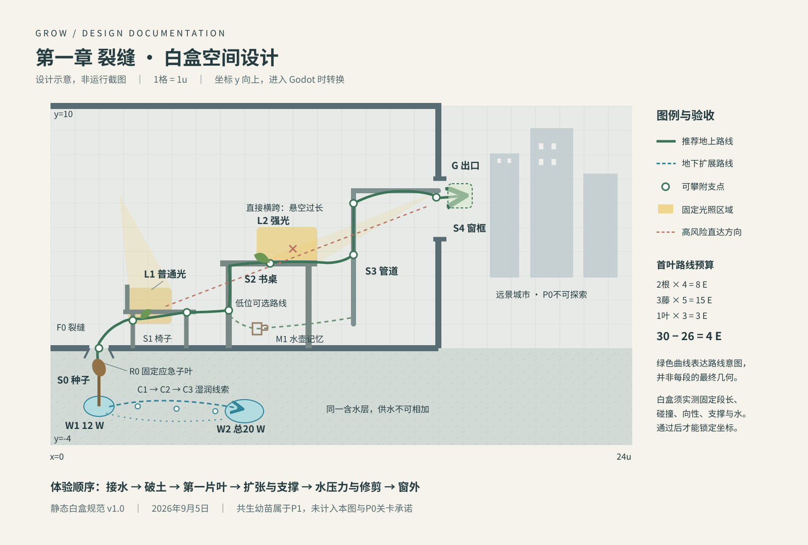

# 向光而生 游戏设计文档

版本：v1.0　日期：2026年9月5日　产品：Grow / 向光而生　范围：比赛 Demo 及后续扩展边界。

本文定义玩家做什么、每次选择付出什么，以及第一章怎样证明核心玩法成立。设计目标是让玩家通过生长构建可持续的植物网络，并在扩张、强化和修剪之间持续选择。采用 Godot，制作方式为用户与 GPT-6 Astra 协作；资源数值是待白盒验证的起点，统一参数见[设计基线](00_设计基线.md)。

## 1 产品定位

玩家是一颗落在废弃公寓地板裂缝中的种子。种子不能移动，根、藤、枝、叶共同组成可选择的身体。每次生长既推进探索，也改变以后能够从哪里继续生长、能接到多少水、哪些地方能接到光。通关后留下的整株植物，就是路线选择和失败修复的记录。

| 维度 | 设计决定 |
| --- | --- |
| 类型 | 2D 横向剖面探索解谜，带轻量网络经营 |
| 核心受众 | 喜欢空间解谜、低反应压力和有机形态创造的玩家 |
| 平台与操作 | Windows，鼠标与键盘，离线单人 |
| 体验时长 | P0 首次游玩15～20分钟，一间公寓与窗外视野 |
| 玩家能力 | 选择生长端点、引导器官、建支点、优化水光、修剪 |
| 核心吸引力 | 自己长出的身体保留在场景中；同一目标可以长出不同形态 |
| 成功定义 | 从裂缝接水、建立光能来源，维持网络并抵达窗外 |
| 失败定义 | 局部功能损失和形态改变；极端情况回到可恢复的种子状态 |

三条不可轻易改变的原则：生长承担移动功能；身体结构持续影响地图；修剪有真实的资源与结构收益。每项新机制都要回答它是否让这三件事更清楚。

### 1.1 方案取舍

连续自由画藤虽然直观，但会让障碍变成绘图技巧问题，也难以准确预览维护成本。每次行动结算一次资源的回合方案易预测，但容易出现无意义的等待回合。本文采用“段落式生长＋低速实时资源模拟”：玩家决定方向，植物在有限偏转内生成自然曲线；观察、感知和预览时暂停，让决策压力来自结构而非手速。

### 1.2 制作范围

P0 包含根、藤、叶、藤强化为枝干、分叉、环境攀附、简单承重、分层光照、叶遮挡、水分运输损耗、局部枯萎、修剪、伤痕、感知、救援、存档和窗外结尾。只制作一个连续关卡，无动物 AI、战斗、天气、昼夜、嫁接、花果、无限地图或可自由移动的人形角色。

P1 是可选的20～30分钟共生尾声，不是比赛版承诺。P2 才考虑城市多章节、生态动物、种子传播与系统结局。P0 已能单独交付，不以“未解锁”按钮展示尚未制作的功能。

## 2 核心循环与决策密度

一次短循环是：观察邻近光、水与支点 → 选择有价值的端点 → 预览一段生长 → 确认并看到身体改变 → 检查新收益与长期成本。两至三次生长后，玩家应需要重新考虑路线或器官，而非连续点击相同方向。

| 时间尺度 | 玩家在做的选择 | 可见反馈 |
| --- | --- | --- |
| 5～15秒 | 继续向窗还是靠墙；长叶还是先扎根；现在是否值得分叉 | 预览曲线、成本、水余额、风险形变 |
| 30～60秒 | 建立新的光能节点，绕到支撑物上，减少低效枝叶 | 能量收入变化、运输脉冲、末端恢复 |
| 3～5分钟 | 从“尽量长远”转向维护结构，选择下一段主路线 | 整株轮廓变化、镜头扩展、探索区域增加 |
| 15～20分钟 | 比较最初的种子与最终植物，理解修剪留下的形态 | 窗外镜头、伤痕保留、整株回顾 |

乐趣来自三种相互约束的收益：更远的枝带来新空间，更好的基础设施让旧空间更有效，主动修剪让资源重新流向真正有用的部分。单纯数值增长不计作内容奖励。

## 3 操作与时间规则

| 输入 | 行为 |
| --- | --- |
| 鼠标左键 | 选择节点；根/藤拖拽方向后松开；叶/强化按下述点击流程确认 |
| 鼠标右键 / Esc | 取消当前预览；空闲时Esc打开暂停菜单 |
| 1 / 2 / 3 / 4 | 根、藤、叶、强化；不可用项目说明原因 |
| 鼠标滚轮 | 缩放；器官轮盘打开时仅切换轮盘项目，避免双重作用 |
| 鼠标中键拖动 | 平移镜头，限制在已揭示范围附近 |
| Shift按住 | 修剪预览；左键选切口，松开Shift退出 |
| Space按住 | 感知模式；另提供点击切换设置 |
| F按住 | 满足条件时催生，3倍模拟速度；释放立即停止 |
| Home | 镜头回到当前选中节点；无选中时回到种子 |

模拟固定步长0.1秒。菜单、失焦、感知、拖拽预览、生长动画期间，能量收入、水危机计时、结构危机计时一起暂停。相机与界面动画使用独立表现时间。没有任何状态允许只积累能量而冻结代价。

一次指令流程：选节点 → 选器官 → 拖出方向 → 查看曲线和代价 → 松开确认。鼠标位移不足12屏幕像素视为取消。拖拽长度只表达意向；根一次0.8u、藤一次1.0u，不因拖得远而长得更长。点击取消不消耗能量。

提交失败保持原有植物和资源不变。失败提示指出具体原因，例如“需要接触土壤”“能量不足2”“节点已有两条延伸枝”“该缝隙不能通过”，而非笼统显示红叉。风险分数大于1且不超过1.5的合法生长允许确认，必须显示风险和受影响下游；超过1.5拒绝提交，防止完全无法支撑的方案。

叶与强化不使用方向拖拽：选中地上节点后选叶，进入固定位置的费用与收益预览，再次左键点击该节点确认；选中一条藤后选强化，显示该边及整株变化，再次左键点击该边确认。右键取消，第一次选择器官不扣费。鼠标重叠时先选择高亮对象，Tab循环邻近候选；12像素拖拽阈值只用于根/藤。

## 4 生长规则与器官

每个节点有稳定身份。曲线交叉只是视觉交叉，不会自动嫁接、接通水或产生支撑。所有活体结构与种子连通；环境锚点只提供支撑。固定的生长段长和有限转角让玩家能预测范围，同时保留植物受到光、水和重力影响的自然形态。

### 4.1 器官可用位置

| 器官或动作 | 可用节点 | 限制与收益 |
| --- | --- | --- |
| 根 | 种子的根插槽、根端点、接触土壤的地上节点 | 全段须处于可生根区域；吸水接入和地下揭示 |
| 藤 | 种子的芽插槽、已有地上节点 | 每节点最多2条地上延伸子边；可依附表面 |
| 叶 | 地上活节点 | 独立1个叶插槽；地下、枯死或已占用节点不可生叶 |
| 强化 | 已有活藤边 | 原位置变成枝干，付费一次；提高支撑并降低水阻 |
| 分叉 | 已有1条地上延伸子边的节点 | 长第二条藤时额外付4 E；不是单独创造免费节点 |
| 土壤侧根 | 进入土壤接触区的地上节点 | 独立1个根插槽，不占地上延伸插槽 |

根子节点也最多2条根延伸子边，第二条根不收地上分叉附加费；其新增根本身照常消耗能量和水。种子提供最多2条初始根与1条初始地上芽。任一器官的子边类型、插槽和动作限制由节点预览直接解释。

### 4.2 方向与自主性

预览综合玩家方向与近邻环境偏向。藤受光轻微牵引并受重力偏向影响，根受湿润方向与向下性影响；碰到可攀附表面可沿其切线贴行。植物的自主偏转应在预览时体现，确认后不得再随机拐弯。输入方向和最终端点方向差建议不超过20度；急转向通过下一段解决。

环境几何禁止穿透。生长路径被阻挡且无法生成完整合法段时取消，不暗中缩短、扣全价或穿过去。关卡缝隙的宽度必须留足藤的碰撞半径与采样误差。危险结构与硬性碰撞分开：前者可冒险，后者不可提交。

## 5 能量与光合作用

初始普通能量30 E，上限40 E。根4、藤5、叶3、第二条地上分枝另加4、强化6。修剪无费用，也无普通能量返还。

每片健康叶的产能为 `1.6 × 光照系数 × 遮挡系数 × 供水系数 × 健康系数 E/秒`。强、普通、弱、暗光分别为1、0.6、0.2、0。光区本身不是穿墙的光源：还要检查墙体和叶片遮挡。叶片朝向由生长方向自动设置，P0 不增加独立旋转操作或朝向倍率。

一片叶采样3条光路，取平均透过率。建筑遮挡为0，每层其他叶片透过率乘0.5。被采样叶不遮挡自己；同一片遮挡叶在一条光路中只计算一次。两片叶完全重叠会提高维护成本，而不会得到两片无遮挡叶的产能。

首叶为普通光，健康且无遮挡时产能0.96 E/秒，一条5 E藤从零开始约需5.21秒。两片普通光叶约需2.61秒。鼓励玩家在资源恢复时观察和规划，但不能把冗长的等候包装成思考。长按F同时加速所有模拟，够支付已选器官即停止；出现萎蔫或结构危险也自动停止。感知和拖拽时不能催生。

### 5.1 开局收支检查

| 动作 | 次数 | 累计成本 | 剩余E |
| --- | --- | --- | --- |
| 两段根接入W1 | 2 | 8 | 22 |
| 三段藤到第一普通光 | 3 | 23 | 7 |
| 长第一片叶 | 1 | 26 | 4 |

白盒必须实际证明这条路线成立，包括向性偏转、碰撞、供水和承重。不能只因表格中的能量够就称开局可解。首个正产能点前不要求分叉、强化或额外叶片。

## 6 水供给与局部运输

水用每秒可维持的供给能力 W 表示，不是能累积在背包里的消耗币。界面显示源端供水Q与包含运输损耗的有效需求D。W1提供12 W；W2是同一个含水层更好的接入点，接通后总上限20 W。重复在W1生根不会让供给叠加，W1与W2也不能相加成32 W。

每个器官有基础需求：根0.15、藤0.35、叶0.8、强化枝干0.5 W。器官到接水节点的路径越长，源端需要提供的水越多。原型水阻按长度计算：根0.08/u、藤0.12/u、枝干0.05/u；经过地上分叉另加0.15。有效需求为 `基础需求 × (1＋累计水阻)`。

例如一片叶基础需水0.8 W，路径累计水阻0.6，则源端需供1.28 W；运输损耗0.48 W。强化会略增该段基础维护，却可能显著降低整条远端支路的运输成本，因此不是无脑升级。

资源不足时依次维持根、枝干、藤、叶，同类优先靠近接水点的器官，以稳定ID打破平局；每分配一份水都从同一个Q扣除。余水不足一份有效需求时按比例供水。剩余器官进入低供水状态，末端组织先出现卷曲和变色。详细计算与完整算例见[TDD](02_技术设计文档_TDD.md)。

新根只有接入真实水区才提供供水能力。剪掉接水根可能同时减少需求和总供给，预览必须把两者都重算。不得默认“剪掉任意根总会有利”。

## 7 支撑与强化

可攀附物通过较清晰的边缘与缠绕凹槽表达：地板裂缝、椅腿、桌缘、管道与窗框。光滑玻璃、空洞和背景装饰不提供支撑。进入锚点捕捉范围时预览出现缠绕环，确认后形成锚定；仅仅画面重叠不算锚定。

承重采用可预测的简化规则，不做实时柔体。每个支撑节点重新开始计算悬空长度；离支点越远、挂叶越多，风险越高。强化改变既有藤段的强度，不把整株植物一起升级。玩家至少能通过新增支点、减少远端叶、缩短支路或强化负载路径中的关键段解决压力。

风险反馈有三个层次：稳定的自然弧线，接近阈值时缓慢下垂，超过阈值时明显弯折并出现短促木纤维声。危险持续到阈值才折断，预览和菜单期间不计时。形变属于表现，不能将碰撞位置扭进墙内或制造意外支点。阈值和计算单一来源是TDD结构章节。

## 8 修剪与失败痕迹

按Shift后鼠标指向一条活边，切口固定在该边靠近父节点的一端；指向叶时只剪该叶，指向节点时等价于剪入边。叶与边重叠时Tab切换高亮目标，确认前始终显示实际影响范围。预览高亮整棵将离线的子树，显示损失叶收入、减少需求、可能失去的水源、受影响的锚点，以及操作后主株风险。点击确认才执行；种子不可剪，不能直接点击某个交叉点把两条边都剪掉。

切下部分立即失去产能、输水、感知和承重功能；不掉落可拾取资源。切口留下伤痕，残枝变为静态装饰，不能再次当免费支点。P0不模拟掉落刚体，也不让离线残枝继续遮挡主株的规则光线，避免表现与资源判定难以解释。

伤口父节点保留侧芽机会：每个原始地上生长插槽的首次人工剪枝最多一次，下一条合法藤的基础费用減2 E，最低1 E，不减分叉附加费；无空余插槽则保持休止。只剪叶、自然断裂、枯死和救援不发优惠。同一插槽反复长剪不重发，优惠不可叠加，不返还旧投入；单条5 E藤即使获得优惠仍花3 E，不能通过循环制造净收益。

正常生长没有Ctrl+Z。关闭游戏再继续会恢复最近完整存档状态，不提供玩家可反复刷资源的逐步撤销列表。开发调试允许重置测试场景，发布界面不暴露调试重置按钮。

### 8.1 枯萎与救援

健康、萎蔫、枯萎和死亡是局部状态。供水改善能够让前两个受损状态逐步恢复；死亡不会自动复活，其下游按连通性失去功能。以供水比例r累计缺水积分z：r低于0.95时每秒增加1-r，供足时每秒回落2；z达到6、12、24分别进入萎蔫、枯萎、死亡。积分而非单帧供水值决定外观，降低短暂波动引起的状态跳变。

暂停菜单始终提供“退守种子”，即使E=3或4、尚未触发自动提醒也可使用。E低于3且普通叶产能低于0.05 E/秒连续3模拟秒时，主动提示。确认前展示整株退守范围；提交后普通E归0、所有普通活体转为历史形状，探索与伤痕保留，W2活体接入与当前远端推进不保留。

固定恢复骨架是从种子到W1的两段0.8u应急根，以及种子独立应急插槽上的子叶。两根各需0.15 W，子叶需0.2 W，正常计入供水与运输；子叶利用裂缝的专用安全光位，以1 E/秒累计最多产生18 E，随后休眠，恰够3藤15 E＋1普通叶3 E。不能将应急器官修剪、分叉或变成远端免费结构；下一次退守会再次清空E和普通活体并重置同一骨架，不叠加收入。玩家可以无限次重新尝试，仍需用当前活藤抵达出口。

固定生存骨架必须由关卡明确提供可接水、可透光的恢复区，不依赖P0没有实现的雨水、昼夜或动物。救援会失去当前远端推进，因而不是免费瞬移或最优扩张循环。

## 9 感知与信息层级

日常画面只保留普通能量、源端供水/有效需求、当前目标短句，以及当前节点的器官轮盘。净能量收入只在选叶或资源不足时展开。植物形态承担健康和结构反馈，数值用于核对原因。

Space感知时，金色光束、青蓝水脉、支点轮廓和低效枝条同时可读；默认突出与当前节点相关的资源路径，避免整株全部发光。地下已探索区保留轮廓，未知区域只显示附近湿润方向，不显示远处水源精确坐标。

根周围1.2u揭示地下形状，2.4u内湿润源提供方向脉冲；超出范围无提示。土壤之外不能利用根尖透视整栋公寓。水源被真正接触后才显示完整容量。所有信息都配合图形、纹理或文字，不能只靠红绿颜色区分。音乐关闭时仍能识别危险。

## 10 第一章裂缝白盒

关卡坐标范围为x=0～24u、y=-4～10u，y向上；Godot中由关卡适配层转换为屏幕向下的坐标。初始镜头只看种子附近，破土后扩展到约16u×9u。以下坐标为白盒设计，不代表已完成的关卡；每个点允许在白盒验证时调整±0.3u，若影响首叶路线成本必须重算。

| 标记 | 坐标或区域 | 用途 |
| --- | --- | --- |
| S0种子 | (2,-0.8) | 不可移动，初始芽与根插槽，救援起点 |
| W1浅层水 | 中心(2,-2.4)，半径0.4 | 两段根可触达；提供12 W |
| W2深层接入 | 中心(8,-2.6)，半径0.5 | 更长地下路线；解锁同含水层总20 W |
| F0地板裂缝 | x=1.6～2.4，y=-0.2～0.4 | 唯一初始破土通道；边缘为支点 |
| L1第一普通光 | x=3.2～5，y=1～2.5 | 由墙缝反射形成的固定光区；保证三藤可达 |
| S1椅子 | x=3～6，y=0～1.5 | 椅腿与椅缘支撑；光滑椅面其余区域不攀附 |
| S2书桌 | x=7～11，y=0～3.5 | 桌腿和桌缘；支持两条空间路线 |
| L2强光 | x=8.5～11，y=3.5～5 | 高回报但远端需水较高，测试分叉与强化 |
| S3管道 | x=12.5，y=1～6.5 | 纵向稳定支撑，通向窗框 |
| M1旧水壶 | (8.5,0.6) | 可选的5秒浇水记忆，无能力解锁要求 |
| S4窗框 | x=16，y=4.5～7 | 最后支点，侧面开口宽度至少0.4u |
| G出口区 | x=16.4～17.4，y=5.8～6.8 | 活藤端点抵达并维持健康3秒触发结尾 |
| 远景城市 | x=18～24区域的背景层 | 结尾视觉范围，不是可探索第二关 |

主路线：S0 → F0 → 椅子与L1 → 桌腿 → 桌缘L2 → 管道 → 窗框 → G。地下路线：S0 → W1 →沿湿润方向到W2。可选近地路线绕桌下方寻找水壶，再到管道；高位路线利用桌缘光源，需要更早加强承重。

错误路线一是从椅子直接横跨到窗户：悬空跨度越过结构阈值，预览即显示危险。错误路线二是在L1下方密集生叶：被遮挡的叶收益低但仍耗水。错误路线三是抢先铺长根却不接水：只增加维护。错误选择都应留下重新规划的可能，不能用不可预知的碰撞或隐藏规则惩罚玩家。

救援区位于S0、W1、F0与L1。固定应急根节点为(2,-0.8)→(2,-1.6)→(2,-2.4)，子叶挂于种子的独立应急插槽，表现接点(2,-0.65)，使用仅对子叶有效的安全光位R0。恢复后的普通路线依次沿裂缝、椅腿、L1生成三段1u藤并挂叶；这些是目标区域，最终端点由共享生长求解器生成并保存为关卡验收回放。必须分别验证初始30 E路线和救援18 E路线，不能只验第一条。

W1到W2间布置三个无供水收益的湿润线索：C1(3.6,-2.4)、C2(5.2,-2.5)、C3(6.8,-2.6)。2.4u内最近尚未揭示的线索提供前进方向，根端进入1.2u后将该线索记为已揭示并指向下一处；最后由W2提供方向。线索间距与0.8u步长逐步回放检查，保证提示不中断；它们不解锁Q、不复制水源，也不在界面提前显示W2精确坐标。

## 11 首次体验节奏

时间是盲测目标窗口，不是脚本强制计时。玩家提前完成就继续推进；玩家选择节约路线时不能凭空减水来制造危机。

| 分钟 | 玩家行为 | 学习点与关卡触发 |
| --- | --- | --- |
| 0～1 | 选择种子，向下预览第一根 | 只显示根图标与方向；取消无代价 |
| 1～2 | 第二根触水，水脉亮起 | 完成“根接水”事件才开放地上芽教学 |
| 2～3 | 沿裂缝破土，镜头展开 | 角色的位置由新身体延伸，不用WASD移动 |
| 3～4 | 贴着椅腿长，出现缠绕环 | 第一次识别支点；不要求承受折断 |
| 4～5 | 对比普通光和阴影，预览首叶 | 光区决定产能，叶不是固定收入道具 |
| 5～6 | 形成首叶，观察资源恢复 | 首次催生可选提示；持续等待过长则记作设计问题 |
| 6～7 | 向桌子或水壶分叉 | 看见第二枝额外成本；允许个人路线 |
| 7～8 | 获得第二处光或探索地下 | 引入近源与远端维护差别 |
| 8～9 | 在桌缘挂叶或尝试横跨 | 预览中看出负载，强化成为可选解 |
| 9～10 | 高扩张玩家出现水紧张 | 因真实需求触发萎蔫；保守玩家继续前进 |
| 10～11 | 感知查看低产能支路 | 明确亏损原因；避免只告诉玩家“水不够” |
| 11～12 | 修剪低效支路或补接W2 | 两种合法解决方向；学习结果以恢复供水判定 |
| 12～13 | 从伤口侧芽重新选择路线 | 一次侧芽优惠，留下切口；不强制剪主干 |
| 13～14 | 沿管道向窗框生长 | 综合使用支点、强化与有效需求预测 |
| 14～15 | 越过窗框，保持活端点健康 | 完成G条件，开始镜头拉远 |
| 15～20 | 新手绕路、可选记忆与修复余量 | 不额外添加任务凑时长；快速玩家可以更早完成 |

修剪教学在首个真实低效支路出现时触发，最多一次解释。对一直节约的玩家提供“选中枝的剪前/剪后比较”与自由尝试机会，不能强制伤害一株健康植物。验证修剪价值时另设标准化过度扩张测试存档，不把所有玩家都安排成同一种错误。

## 12 目标与叙事

主线提示依次为“接到湿润的地方”“找到能养叶的光”“让枝条靠上支点”“抵达窗外”。提示描述观察目标，不要求玩家完成固定数量的根叶。记忆触发后以水滴、暖色旧影和短音色表达曾有人浇水，无对白树和收集册。

P0结尾条件为与种子连通的活藤端点进入G区域，供水与健康满足要求并维持3秒；暂停不累计。镜头缓慢展示全株、切口和窗外城市，再出现GROW标题与“继续观察／返回标题”两个按钮。结尾不因有多少叶、是否按推荐路线或是否看过水壶而锁住。

P1共生尾声在窗外增加一株濒死幼苗；P0加尾声后的总体验目标20～30分钟，并非另加20～30分钟。共享资源必须把对方的需求也计入同一供水预算；玩家可通过修剪或改变接入解决。源说明中的20总水、自身18、幼苗8、自身降到11仅是主题演示数字，不能直接混入P0运输损耗模型。真正制作P1前要重新用同一算法验证其供水不等式与可解路线，不能写成剧情按钮自动通关。

远期“巨树／森林”结局以生态反馈展示选择代价，不预设道德评分；当前Demo只埋下窗外其他生命的视觉线索。

## 13 声音与可访问性

根接水出现低频水脉，首叶产能成立时第一次加入旋律层，危险时使用短而可定位的纤维声，修剪保留干净的断口声与环境余音。音频不承担唯一提示，也不使用持续警报逼迫玩家操作。

P0支持主音量与音乐/音效分别调整、文字缩放、感知按住/切换、低动态模式和关闭镜头晃动。拖拽预览时暂停可降低操作负担。默认无闪烁频闪，无倒计时惩罚；失焦自动暂停。中文UI采用清晰字形，器官说明不使用只有生物学背景才能理解的术语。

## 14 数值验证与验收

| ID | 验证问题 | 通过目标 |
| --- | --- | --- |
| G-01 | 玩家是否理解生长就是移动 | 5名新玩家中4名在2分钟内完成首根接水 |
| G-02 | 最小水光闭环是否可解 | 标准路线花26 E建立首叶；5人中4人6分钟内达成 |
| G-03 | 是否有真正的空间策略 | 测试中观察到至少两条可通关路线，且不是穿墙捷径 |
| G-04 | 修剪是否有系统价值 | 标准化危机中剪前/剪后水与产能变化可核算；单独的补充任务中4/5在至多一次提示下解决问题 |
| G-05 | 是否陷入等资源 | 强制等待占可操作时间≤10%；单次普通等待的95分位≤8秒 |
| G-06 | 是否因错误死档 | 花尽E、剪掉供水、失去全部叶、远端折断四种状态均可恢复 |
| G-07 | 是否存在刷取 | 反复剪长、重复扎同一水源、暂停催生都不能凭空产能或复制供水 |
| G-08 | 关卡是否完整 | 首次通关中位时长15～20分钟；无阻断主流程的问题 |
| G-09 | 反馈是否清楚 | 4/5能区分缺水、缺光与超载；静音与灰度查看仍可识别警告 |

自然首玩不强制制造危机；若未出现管理问题，完整记录其节约路线，通关后再用统一危机存档做G-04补充任务。补充任务的时间、求助和结果单独计，不并入15～20分钟首玩数据。

等待定义为玩家已选择合法动作、当前仅因E不足不能提交且无其他正在进行的操作。感知、菜单、失焦不计入可操作时间。记录本地事件：节点选择、预览开始/取消、提交成功/失败及原因、资源不足时长、接水、首叶、首次修剪、救援、结尾。默认不上传，试玩使用匿名编号。

若核心循环不好玩，先调整段长、首光距离、收入与维护、支点间距、预览信息；不要用动物、更多器官或大量剧情掩盖问题。若玩家只点最近光源，增加路线权衡；若所有人都修剪同一枝，检查关卡是否只剩单解；若玩家不敢扩张，降低早期错误成本和教学负担。

## 15 文档交接

程序实现按[TDD](02_技术设计文档_TDD.md)的算法和数据；状态视觉按[美术指南](03_美术风格指南_Art_Bible.md)；工时、验收门禁与范围变更按[项目管理文档](04_项目管理文档_PM.md)。设计变更必须同步修改基线、涉及的关卡样例和验证指标。旧稿按项目备份规则整体迁移留档，不直接删除内容。

创意来源：[Grow项目设计上下文](../Grow%20游戏创新创作大赛——项目设计上下文与后续深化说明.md)。原始创意中的完整版生态愿景保留为P2；本文件新增了可执行的P0规则、关卡坐标与验证要求。
