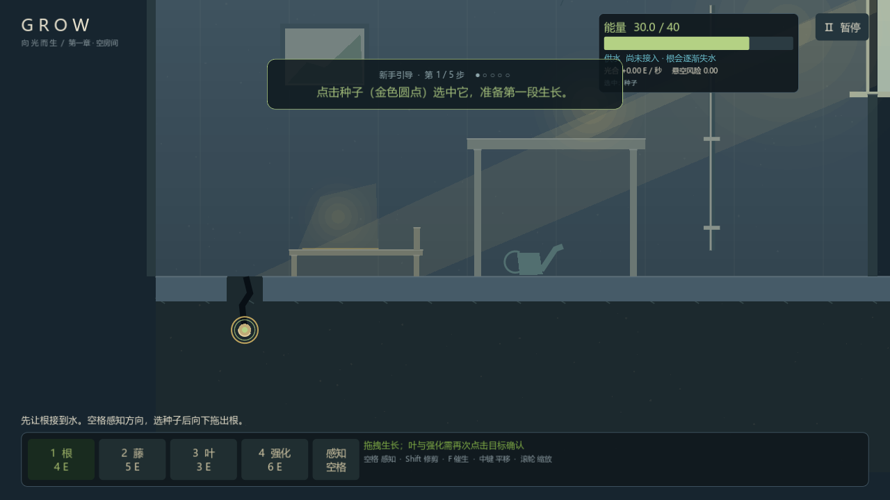
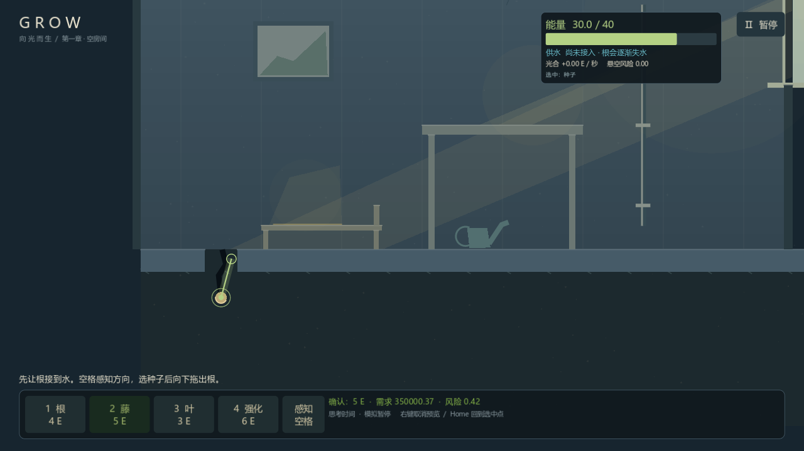
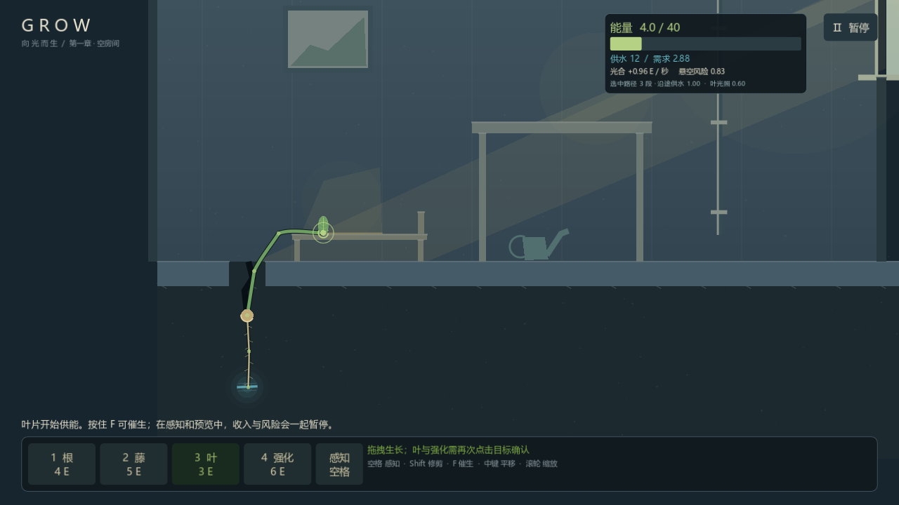
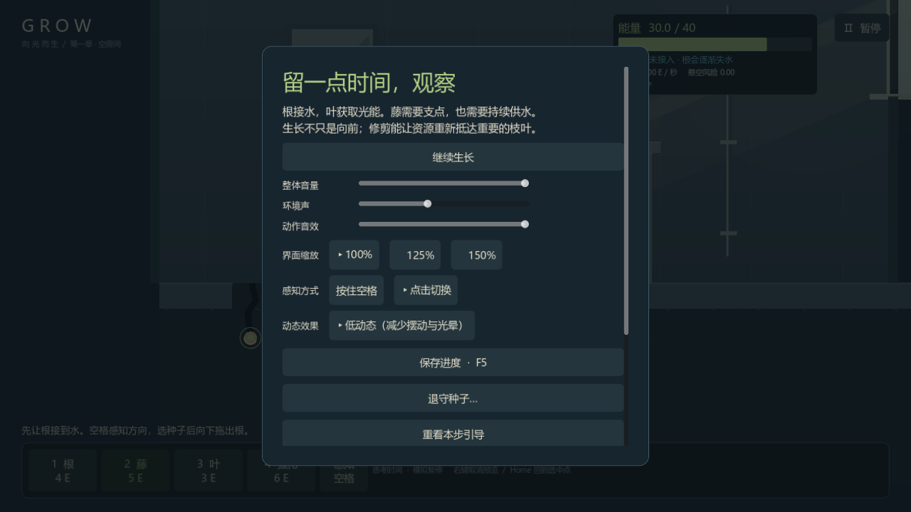
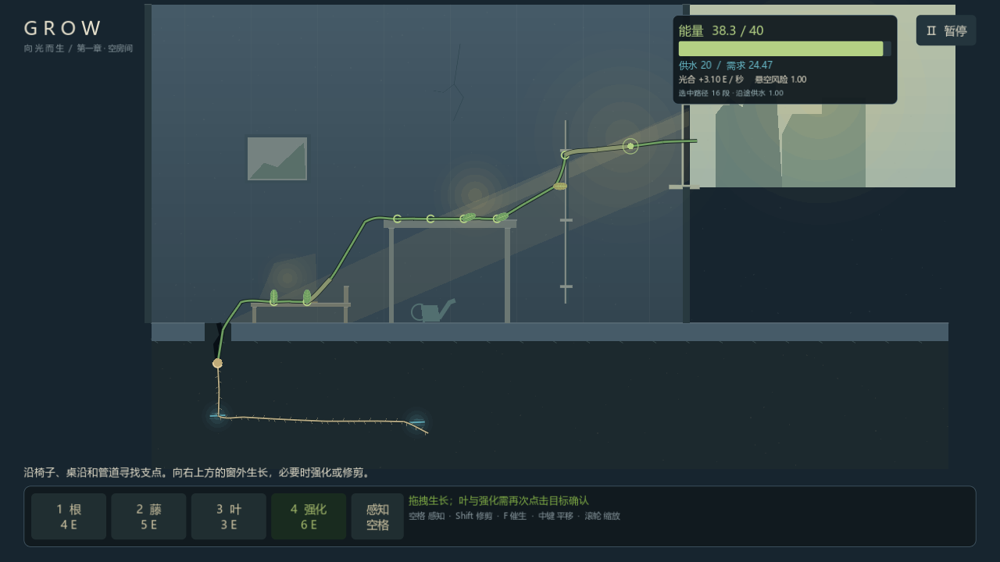
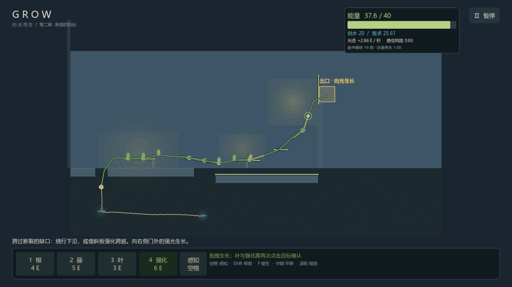

# 《向光而生》游戏说明

一株植物的生长探索游戏。你无法移动，只能生长——用根须寻找水源，用藤蔓攀附家具，用叶片收集光能，在没人居住的房间里，把自己长成一条通往窗外的路。

## 游戏背景

一个无人居住的旧房间，地板的裂缝下藏着水源。一颗种子在黑暗中醒来，没有脚，没有手，只有向上生长的本能。

房间里有旧椅子、画框、水壶和一张桌子，它们不是装饰——每一样都是可以攀附的支点。裂缝深处有水，桌子上有阳光，窗外在更远的地方亮着。剪去的枝会留下伤痕，留下的伤痕也是这株植物的一部分。

- **第一章《空房间》**：学会生长。接水、取光、攀附、强化、修剪与退守，从地板裂缝一直长到窗外。
- **第二章《断裂的阳台》**：学会取舍。阳台中部断裂，光很好但支点稀疏——绕行下沿，还是强化跨越？第二处水源就藏在缺口正下方，取它要冒险，修剪低效的支路才能把水让给主干。

## 核心玩法

### 三种生长

| 器官 | 作用 | 消耗 |
| --- | --- | --- |
| **根** | 沿土壤伸向水源；根尖接触水，全株才有持续供水 | 4 E |
| **藤** | 向上生长的茎，靠近家具会自动缠上支点 | 5 E |
| **叶** | 在光照区域收集能量，是唯一的能量来源 | 3 E |

能量（E）是生长的货币：叶片每小时刻产生能量，积累够了就能继续生长、强化或修剪。

### 支点与悬空负载

藤悬空太长会被自身重量压断。靠近椅子、桌沿、栏杆等表面时，藤尖会自动**缠上支点**（金色圆环）——悬空负载从这里重新计算，放心继续伸展。

### 强化与修剪

- **强化（6 E）**：把一根普通藤变成粗壮的枝，承重能力大幅提升——跨越缺口或长距离悬空前先强化。
- **修剪**：剪掉低效的枝叶。被剪处会留下残枝与伤痕，能量不返还，但**省下的供水会流向留下的枝叶**——生长不只是向前，修剪能让资源重新抵达重要的地方。

### 感知与预览

所有生长在确认前都会暂停模拟，并以半透明曲线**实时预览**形态、消耗、需水与悬空风险。按住 **空格** 感知湿润与光照方向；感知模式下选中任意器官，还能查看它到种子的供水路径与状态（缺水 / 遮光 / 承重吃力）。

### 退守种子

走投无路时可以从暂停菜单**退守种子**：能量归零，所有普通枝叶退为残痕，种子恢复两条固定根和一片应急子叶（最多提供 18 能量）——足够重新长出三段藤和一片叶。探索与记忆会保留，失败不是终点。

## 操作说明

| 操作 | 按键 |
| --- | --- |
| 选择工具 | `1` 根 · `2` 藤 · `3` 叶 · `4` 强化（或点击底部按钮） |
| 生长 | 选中生长点后**按住左键拖出方向**，松开确认 |
| 叶 / 强化 | 选中目标后**再次点击**确认 |
| 感知 | 按住 `空格`（可在设置中改为点击切换） |
| 修剪 | `Shift` 进入修剪模式，点击高亮的叶或枝段 |
| 催生 | `F` |
| 重叠目标切换 | `Tab` |
| 相机 | 中键拖动平移 · 滚轮缩放 · `Home` 回到选中点 |
| 暂停 / 退守 | `Esc` 或右上按钮 |
| 保存 | `F5`（每 10 条命令、首叶、退守、通关、退出时自动保存） |

## 新手引导

第一章开局有五步引导（选种子 → 拖根接水 → 长藤 → 攀附 → 长叶），顶部提示卡只提示当前一步，完成后自动进入下一步。卡住约 45 秒会自动追加详细帮助；暂停菜单里可以**重看本步引导**或**跳过引导**，进度随存档保存。第二章不再重复引导。

## 暂停菜单与设置

暂停菜单提供音量（整体 / 环境声 / 动作音效）与可读性设置：**界面缩放**（100% / 125% / 150%）、**感知方式**（按住空格 / 点击切换）、**低动态**（减少摆动与光晕）。设置随 `settings.cfg` 持久化。

## 存档与章节

- 每章独立存档（`user://saves/chapter1`、`chapter2`），每代使用新文件，损坏自动回退，未来版本存档会拒绝加载以保护进度。
- 通关第一章后，标题页解锁第二章；重玩前一章不会收回已解锁的章节。
- 通关后可以继续观察你的植物，或从标题页回看任意章节。

## 运行要求

- Windows 10/11 x86_64
- 支持 OpenGL 3.3 的显卡
- 双击 `Grow.exe` 即玩，无外部依赖；完整通关约 15～20 分钟

## 开发

引擎为 Godot 4.7.2（Compatibility 渲染），源码与开发文档见 [README](../README.md)。当前版本 v0.1.2。

